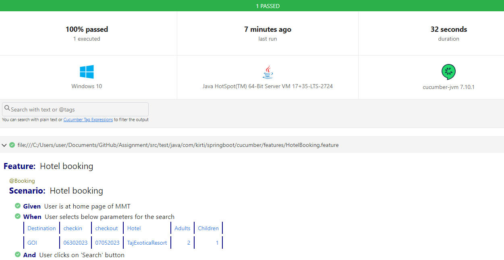

# selenium-springboot-cucumber-restassured - All in one using Aspect programming

**Tech Stack:**

-Java 17
-Selenium 4.x
-JUnit 5.x (Jupiter)
-Cucumber 7.x
-Spring Boot 3.0.1
-RestAssured 5.0.1

**BDD**
Used here cucumber framework to achieve abstraction for view as feature 

**Reporting:**
The reporting is achieved by cucumber reporting 
Published into View your Cucumber Report at:                                            │
│ https://reports.cucumber.io/reports/a948be90-efb4-4a3f-953a-479c889c4b8a │
│                                                                          │
│ This report will self-destruct in 24h.                                   │

**Log:**
Execution logs are logged into execution.log under "target.exec.temp" as defined in application.properties 

**Screenshot:** 
Created an annotation as well as calling in after hook in case of failure 

**How to Run Tests**
We can run the test in the command line with the maven command below. The below command is for the zhs terminal.

mvn -Dtest="com.kirti.springboot.tests.**" test
The command below is for the bash terminal.

mvn -Dtest=com.kirti.springboot.tests.** test
If we want to select a specific profile, we have to specify this as shown below.

@Profile(“grid”) annotation is for Selenium Grid and remotewebdriver. When we run the tests with “spring.profiles.active=grid” environment variable, the tests will use application-grid.properties file under the resources folder as the main configuration file.@Profile(“grid”) annotation is for Selenium Grid and remotewebdriver. When we run the tests with “spring.profiles.active=grid” environment variable, the tests will use application-grid.properties file under the resources folder as the main configuration file.

