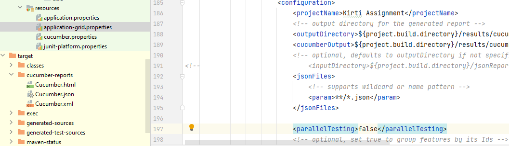

# selenium-springboot-cucumber-restassured - All in one using Aspect programming 

Reporting:
The reporting is achieved by cucumber report 

Log:
Execution logs are logged into execution.log under "target.exec.temp" as defined in application.properties 

Screenshot :
Created an annotation as well as calling in after hook in case of failure 

How to Run Tests
We can run the test in the command line with the maven command below. The below command is for the zhs terminal.

mvn -Dtest="com.kirti.springboot.tests.**" test
The command below is for the bash terminal.

mvn -Dtest=com.kirti.springboot.tests.** test
If we want to select a specific profile, we have to specify this as shown below.

